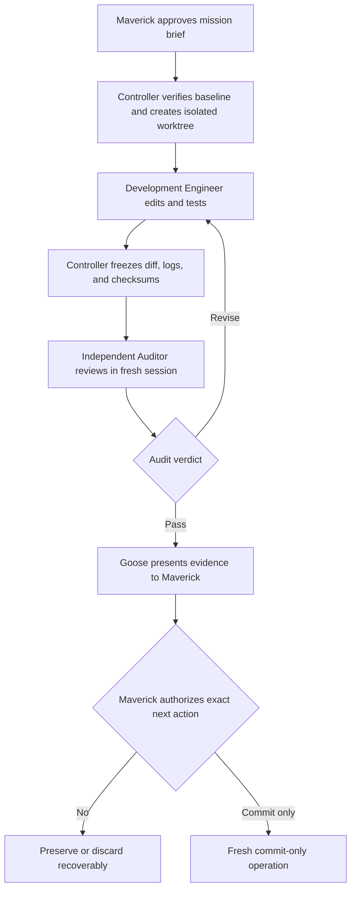

<!-- wingman-archive-metadata
{
  "schema_version": 1,
  "classification": "historical_noncanonical",
  "canonical_replacement": null,
  "archived_from": null
}
-->

> [!WARNING]
> **HISTORICAL / NONCANONICAL ARCHIVE.** No single canonical replacement
> exists; current authority must be resolved from `AGENTS.md`,
> `CURRENT_MISSION.md`, `docs/missions/`, and `docs/decisions/`.

# Archived — Wingman Pre-Mission 028 Planning Package

> Archived on 2026-08-07 by `governance/repository-architecture`. This package
> is preserved as dated planning evidence and does not own current mission
> status. Its still-governing decisions are extracted to
> [GOV-002](../../decisions/governance/roadmap-sequencing.md),
> [OPS-001](../../decisions/governance/development-flightline.md), and the
> completed [Hardpoints mission record](../../missions/wingman-os/hardpoints/mission.md).

**Prepared by:** Goose, Wingman Mission Control
**For:** Maverick — David Shimmon
**Date:** August 1, 2026
**Version:** 1.1 — decision-status reconciliation
**Status:** Approved by Maverick; planning baseline only; no implementation authorized

---

## Canary Check

**CANARY:** CANOPY-7C2F-ATLAS
**STATUS:** AMBER
**MAVERICK:** Recognized
**GOOSE:** On station
**CURRENT MISSION:** Development Flightline Auditor-activation correction; Mission 028 implementation has not begun
**LAST COMPLETED:** Mission 027 — Airframe; complete and committed per Maverick, with documentary reconciliation below
**NEXT GATE:** Fresh Independent Auditor review launched from a controller-issued, frozen-evidence-bound envelope; Mission 028 still requires explicit implementation authorization
**CONFLICTS:** The original planning workspace could not inspect the live checkout. That limitation is preserved as historical context below; later Flightline preflight evidence does not authorize Mission 028 implementation.

AMBER does not block planning. It blocks treating the live repository as launch-ready until a new Codex session verifies the actual checkout.

---

# Part I — Authority, Evidence, and Current-State Reconciliation

## 1. Evidence Classes Used in This Package

This package separates what is established from what is recommended.

| Label                          | Meaning in this package                                                                                                                                                     |
| ------------------------------ | --------------------------------------------------------------------------------------------------------------------------------------------------------------------------- |
| **Established**                | Controlled by Maverick's current instruction, a current canonical repository record, or a previously verified repository result that is not contradicted by newer evidence. |
| **Documentary verification**   | Supported by the supplied Mission 027 journal or another named record, but not re-run against the live repository in this workspace.                                        |
| **Reported Git evidence**      | Exact Git evidence captured in prior Mission Control sessions. It is credible historical evidence, but the current checkout must still be inspected before launch.          |
| **Provisional recommendation** | Goose's proposed roadmap, operating model, scope choice, or sequencing decision. It does not become canonical until Maverick approves it.                                   |
| **Deferred**                   | Intentionally preserved for a later mission and not authorized now.                                                                                                         |

## 2. Sources and Their Authority

| Source                                        | Authority in this operation                                              | Use                                                                                                                                                                                            |
| --------------------------------------------- | ------------------------------------------------------------------------ | ---------------------------------------------------------------------------------------------------------------------------------------------------------------------------------------------- |
| Maverick's current instruction                | Highest                                                                  | Defines the three requested outputs, the planning-only boundary, the temporary nature of the Codex roles, and the prohibition on unauthorized commits, pushes, merges, or destructive actions. |
| `Mission-027-Wingman-Defines-the-Boundary.md` | Canonical repository-record copy for Mission 027's architectural outcome | Establishes the final Airframe scope, 167-test closeout, retained Ledger schema v3, accepted limitations, and explicit exclusions.                                                             |
| Prior Mission Control Git inspections         | Historical Git evidence                                                  | Distinguishes the Airframe implementation commit, canonical-record reconciliation commit, and later Vault-status reconciliation commit.                                                        |
| `Wingman_Project_Context_Drafts.zip`          | Draft planning context only                                              | Preserves enduring principles, future capabilities, and the original 027–029 roadmap. Its obsolete Mission 027 status, 153-test count, and Migration 4 material are superseded.                |
| Current OpenAI Codex manual                   | Current product-control evidence                                         | Grounds the unattended Codex model in workspaces/worktrees, sandboxing, approval policies, non-interactive execution, permission profiles, and hooks.                                          |

## 3. Mission 027 Reconciliation

### 3.1 Established architectural outcome

Mission 027 — **Wingman Defines the Boundary**, call sign **Airframe**, is complete for its approved logical-architecture scope.

The supplied journal establishes that Airframe:

* assigned ownership among Wingman OS Core, Shared Product Framework, Atlas, and Product Configuration;
* moved generic ingestion, retrieval execution, and shared conversation context behind product-neutral seams;
* kept academic interpretation, vocabulary, metadata meaning, and product policy in Atlas;
* introduced a small product-configuration boundary and only the minimal contract required by Airframe;
* retained Ledger schema version 3 as deprecated legacy storage behind a private anti-corruption adapter;
* preserved historical compatibility surfaces where immediate removal would have expanded scope;
* added bounded architecture checks and focused integration coverage;
* retained all 141 original tests byte-for-byte;
* added 26 Airframe tests;
* passed 167 tests in total, plus compilation and diff-whitespace validation;
* performed no live migration, live-data write, real credential use, or network model call.

Airframe did **not** implement the final product contract, dynamic plugins, a second product, agents, a Crew Chief, Ledger Migration 4, global readiness, cross-process locking, backup/restoration, or a final package layout.

### 3.2 Reconciled commit roles

The hashes reported in prior sessions describe different events rather than competing versions of the same commit.

| Hash                                       | Reported subject                             | Reconciled role                                                                                               |
| ------------------------------------------ | -------------------------------------------- | ------------------------------------------------------------------------------------------------------------- |
| `e1570b0c0d759933eaa0d2d0b48839051337d441` | `Establish product-neutral Wingman Airframe` | Mission 027 implementation commit.                                                                            |
| `7c3402cce5e9a476d18e3b23b8248a9d4793b562` | `Reconcile Mission 027 canonical records`    | Later documentation reconciliation affecting `docs/architecture/Airframe.md` and the Mission 027 journal.     |
| `4cabb431829a29357c6ead8c00fd7539b7e91fa7` | `Reconcile Wingman Vault status`             | Later Vault-status reconciliation affecting `WINGMAN_VAULT.md`; it is not the Airframe implementation commit. |

### 3.3 Original live-repository verification boundary

The original planning workspace contained the supplied records but not the Wingman Git checkout. The following therefore had to be verified in a later Codex session before any Mission 028 implementation:

1. Repository path and applicable `AGENTS.md` instructions.
2. Current branch and exact `HEAD`.
3. Whether the three commits above are present in the expected ancestry.
4. Local-versus-remote divergence and whether anything has been pushed.
5. Current working-tree, index, and untracked-file state.
6. Whether unrelated `.DS_Store` files and the Office lock file remain present.
7. Current canonical locations and versions of Airframe, the mission journal, Project Context, Roadmap, Vault, Glossary, and Mission History.
8. Current full-suite baseline; 167 is the verified Mission 027 closeout count, not a number to assume forever.

### 3.4 Operational conclusion

Mission Control is operational for planning. Mission 027's architectural state and commit roles are reconciled sufficiently to design Mission 028. Maverick later approved the brief in Part IV and separately authorized the Development Flightline setup. Those decisions did not authorize Mission 028 implementation, which remains **not cleared for launch** without a separate implementation instruction and envelope.

---

# Part II — Strategic Roadmap for Missions 028–037

## 4. Governing Sequence

The established strategic rule remains:

> **Separate first. Measure second. Scale third. Secure fourth. Govern fifth. Expand sixth.**

The roadmap below turns that principle into a ten-mission planning horizon. Missions 028 and 029 have established identities and objectives. Mission 030 has an established direction but must be shaped by Mission 029 evidence. Missions 031–037 are provisional recommendations and must each receive a separate brief and approval before implementation.

## 5. Roadmap

| Mission                         | Status of decision                                                   | Strategic objective                                                                                                                                                                                    | Exit gate                                                                                                                                                                              |
| ------------------------------- | -------------------------------------------------------------------- | ------------------------------------------------------------------------------------------------------------------------------------------------------------------------------------------------------ | -------------------------------------------------------------------------------------------------------------------------------------------------------------------------------------- |
| **028 — Hardpoints**            | **Brief approved; implementation unauthorized; full brief in Part IV** | Create the explicit, typed, versioned product contract through which Atlas attaches to Wingman OS. Prove the seam with a minimal test-only product without adding product logic to Core.               | Atlas operates through the contract; a non-Atlas fixture attaches without product-specific Core changes; existing behavior and source traceability remain intact.                      |
| **029 — Rangefinder**           | **Established mission identity and direction; final brief deferred** | Build Wingman Assurance v1: Retrieval Test Range, Flight Recorder, Error Log, Efficiency Analysis, and a saved quality/performance baseline.                                                           | All current retrieval paths and critical source-grounded behavior have measurable baselines; requests and failures are correlated without logging sensitive content by default.        |
| **030 — Retrieval Scalability** | **Direction established; exact scope evidence-gated**                | Use Rangefinder measurements to replace broad scanning with namespace filtering, indexed/hybrid candidate generation, deduplication, reranking, weak-evidence rejection, and evidence/context budgets. | Retrieval effort grows sublinearly with source volume while approved quality, source coverage, abstention, latency, and context budgets remain within Rangefinder thresholds.          |
| **031 — Storage Port**          | **Provisional recommendation**                                       | Define storage interfaces for sources, knowledge objects, concepts, embeddings, originals, workspaces, missions, and assurance events. Retain current local storage as the first adapter.              | Products and retrieval logic no longer depend on physical paths or a particular persistence engine; adapter parity tests protect current behavior. No production migration is implied. |
| **032 — Ledger Concurrency**    | **Provisional recommendation**                                       | Add isolated runtime workspaces, version checks, idempotency, fine-grained resource coordination, conflict detection, and serialized shared-truth commits.                                             | Concurrent work cannot silently overwrite accepted state; conflicts are retried, rebased, merged, or escalated explicitly; recovery behavior is tested.                                |
| **033 — Ledger Black Box**      | **Provisional recommendation**                                       | Add an immutable event journal for audit, replay, recovery, and historical reconstruction while keeping current-state retrieval optimized.                                                             | Every accepted state transition has a reconstructable event path; normal retrieval does not replay history; retention and recovery semantics are explicit.                             |
| **034 — Contrail**              | **Provisional recommendation**                                       | Build the Evidence Graph: Source → Evidence → Claim → Inference → Recommendation → Action.                                                                                                             | Material claims preserve exact source paths; sourced facts and Wingman judgment remain distinct; changed or removed evidence identifies affected downstream conclusions.               |
| **035 — Truth Clock**           | **Provisional recommendation**                                       | Add event time, effective time, publication time, ingestion time, and supersession time to trustworthy knowledge.                                                                                      | Wingman can answer what was believed, valid, or known at a specified time and can explain which source superseded an earlier claim.                                                    |
| **036 — Persistent Cockpit**    | **Provisional recommendation**                                       | Persist conversations, briefings, drafts, active product/workspace, mission state, preferences, recent activity, and the user's exact return point without treating conversation as truth.             | A user can leave and return without losing work; persisted conversation guides interpretation but factual answers still retrieve fresh authorized evidence.                            |
| **037 — Secure Hangar**         | **Provisional recommendation**                                       | Establish identity, authentication, encryption, product/workspace isolation, permissions, audit trails, backups, tested recovery, retention, verified deletion, export, and Source Rights Records.     | Wingman can make a credible trust case for persistent and third-party material. Governed in-product agents and Radar remain gated until this foundation is accepted.                   |

## 6. Roadmap Boundaries and Dependencies

### 6.1 Decisions already established

* Hardpoints precedes product expansion.
* Rangefinder precedes major retrieval optimization.
* Retrieval Scalability is the intended Mission 030 direction, but its exact brief must be based on Mission 029 evidence.
* Storage abstraction precedes any physical storage migration.
* Assurance, continuity, concurrency, and security precede governed in-product agents.
* Mission Control and Rules of Engagement precede a future Chief of Staff.
* Radar remains a separate future product and must attach through the product contract rather than shape Core prematurely.

### 6.2 Provisional sequencing rationale

1. **030 before 031:** Measure and reduce retrieval inefficiency while the current storage behavior remains a stable baseline. If Rangefinder shows storage is the dominant constraint, Maverick may reverse these two after explicit review.
2. **031 before 032:** Concurrency rules should target stable storage interfaces rather than current file paths.
3. **032 before 033:** The Black Box should record well-defined accepted transitions and conflict outcomes, not unstable mutation semantics.
4. **033 before 034:** Contrail benefits from an immutable transition history but must not make the event log the normal retrieval path.
5. **034 before 035:** Truth Clock enriches a stable provenance graph. The exact boundary between the two missions should be re-evaluated when Contrail is briefed.
6. **035 before 036:** Persistent continuity should preserve temporal and supersession meaning rather than store only the latest state.
7. **036 before 037:** Persistent Cockpit may be proven locally with fixtures and non-sensitive data. It may not claim production trust or accept sensitive third-party material until Secure Hangar is complete.

Security is a continuous constraint across all missions. Mission 037 is the formal trust boundary, not the first time secure engineering matters.

### 6.3 Unnumbered future-work boundary

The ten-mission horizon intentionally stops before governed agents and Radar.

Future work not numbered by this package includes:

* Mission Control runtime;
* Rules of Engagement;
* isolated in-product agent workspaces;
* governed orchestration;
* a future Chief of Staff;
* Radar and its Lead, Research, and Financial Analysis Wingmen.

None of those capabilities is authorized or numbered by this package.

Crew Chief is a separate, required future Wingman Assurance capability. It is not a prerequisite for Mission 028, is not the Development Flightline Independent Auditor, and must not be represented as that Auditor. Crew Chief is not automatically deferred until after Mission 037. Maverick will decide its exact roadmap placement after Hardpoints and before the relevant Assurance mission.

---

# Part III — Development Agent Operating Model

## 7. Status and Purpose

**Status:** Approved by Maverick on August 1, 2026. It was not installed by this original planning operation; the Development Flightline setup was authorized separately afterward. Maverick subsequently authorized the bounded correction that makes the required fresh Auditor envelope controller-issued, expiring, and single-use after the first audit correctly rejected an absent activation path.

The model creates controlled Codex development roles that can inspect, edit, test, and audit while Maverick is away from the computer. It removes routine approval interruptions by establishing hard boundaries before launch. When a role reaches a boundary, it fails closed, preserves evidence, and reports `BLOCKED`; it does not seek a broader permission in the middle of the run.

These are temporary **development-plane Codex roles**. They are not Wingman OS agents, are not part of Hardpoints, do not use the future in-product agent contract, do not constitute Mission Control runtime, and must not be called Crew Chief.

## 8. Recommended Operating Pattern: Two-Key Flightline

The approved normal operating pattern uses two sequential Codex roles:

1. **Development Engineer** — owns implementation inside one isolated worktree.
2. **Independent Auditor** — evaluates the frozen change in a separate, fresh session and cannot fix the code it reviews.

A deterministic launcher/controller surrounds them. The controller is software, not an AI authority.

The Auditor must not be a child of the Engineer's session. Separate sessions reduce anchoring, prevent inherited task drift, and allow different write permissions. Codex subagents can be useful for read-heavy exploration, but they inherit the parent run's permission posture and are not the primary independence boundary for this model.

One mutable Development Engineer owns each bounded mission worktree. Additional mutable Development Engineers require explicitly partitioned scopes and Maverick's authorization. Every mutable Engineer is followed by a fresh, separate Independent Auditor for the frozen scope.

## 9. Roles and Authority

| Role                        | Type                                          | Authority                                                                                                                                                                       | Prohibitions                                                                                                                                                    |
| --------------------------- | --------------------------------------------- | ------------------------------------------------------------------------------------------------------------------------------------------------------------------------------- | --------------------------------------------------------------------------------------------------------------------------------------------------------------- |
| **Maverick**                | Human mission commander                       | Approves scope, roadmap, mission brief, exceptional permissions, commits, pushes, merges, and mission completion.                                                               | None within the project; Maverick remains final authority.                                                                                                      |
| **Goose / Mission Control** | Human-facing planning and audit function      | Reconciles records, prepares briefs, evaluates Engineer and Auditor evidence, surfaces conflicts, and recommends a decision.                                                    | Cannot silently expand scope or treat implementation as approved.                                                                                               |
| **Flightline Controller**   | Deterministic launcher and evidence collector | Captures baseline, creates isolated workspaces, applies permission profiles, enforces budgets/timeouts, freezes artifacts, and verifies postflight invariants.                  | Cannot interpret approval, change code, commit, push, merge, or waive a failed gate.                                                                            |
| **Development Engineer**    | Temporary Codex role                          | May inspect, edit authorized files in its disposable worktree, run approved local commands/tests, update required documentation, and prepare a proposed diff.                   | No shared checkout, live data, secrets, external writes, scope expansion, staging, commit, push, merge, rebase, tag, release, deploy, or destructive operation. |
| **Independent Auditor**     | Separate temporary Codex role                 | May inspect the approved brief, baseline, frozen diff, code, tests, and logs; may run approved verification in an isolated audit copy; returns findings and an evidence matrix. | No production-code fixes, no commit authority, no approval authority, and no reliance on the Engineer's conclusion before its own first-pass review.            |
| **Commit Operator**         | Fresh, dormant operation after approval       | May stage the exact reviewed file set and create the exact authorized commit after Maverick's explicit instruction.                                                             | No implementation, no opportunistic cleanup, no push or merge unless separately authorized. It never runs unattended before approval.                           |

## 10. Mission Authorization Envelope

Every unattended run must be launched from a versioned, machine-readable authorization envelope. At planning approval the exact file format was left to the separately authorized setup operation, subject to these minimum fields:

* mission number, name, and call sign;
* role identity;
* approved objective;
* baseline commit SHA;
* allowed repository root and isolated worktree path;
* allowed and denied file scopes;
* protected data paths;
* approved test and validation commands;
* network policy, normally `off`;
* credential policy, normally `none mounted`;
* time, token, and command budgets;
* allowed temporary-output paths;
* acceptance criteria;
* explicit exclusions;
* mandatory stop conditions;
* required completion-report schema;
* canary token and launch-state fields;
* statement that commit, push, merge, and destructive authority are absent.

The implemented Flightline envelope format is now version 1.1. An Auditor
envelope is never hand-authored: the controller derives it from an approved
Engineer envelope and verified frozen handoff, forces role
`independent-auditor` and state `PREFLIGHTED`, binds the baseline, frozen
manifest, diff, complete evidence package, protected audit snapshot,
foreground preflight, runtime, prompt, and audit-output paths, and seals it to
an issuance record outside role-writable scope. It expires within 24 hours and
is atomically consumed once at launch. The deterministic controller records
authorization supplied by Maverick's operator action; it does not interpret or
create human approval.

The envelope is permission, not a suggestion. Silence in the envelope means the action is not authorized.

## 11. Permission Matrix

| Action                                                                    |                                                                              Development Engineer |                                Independent Auditor |
| ------------------------------------------------------------------------- | ------------------------------------------------------------------------------------------------: | -------------------------------------------------: |
| Read authorized repository files                                          |                                                                                               Yes |                                                Yes |
| Edit mission-scoped files in isolated worktree                            |                                                                                               Yes |                                                 No |
| Create test fixtures or temporary outputs                                 |                                                                        Yes, within declared paths | Only audit/test outputs in a disposable audit copy |
| Run approved local tests and static checks                                |                                                                                               Yes |                                                Yes |
| Run arbitrary project commands                                            |                                                                                                No |                                                 No |
| Install or upgrade dependencies during the agent phase                    |                                                                                                No |                                                 No |
| Use network access                                                        |                        No by default; mission-specific allowlist requires prior Maverick approval |                                      No by default |
| Read `.env`, credentials, SSH keys, tokens, or unrelated user files       |                                                                                                No |                                                 No |
| Read or write the live Ledger or other shared truth                       |                                                                                                No |                                                 No |
| Delete or rename files                                                    | Only when the approved brief names the removal and the change remains recoverable in the worktree |                                                 No |
| Modify the shared/local foreground checkout                               |                                                                                                No |                                                 No |
| Stage files or mutate `.git`                                              |                                                                                                No |                                                 No |
| Commit, amend, tag, rebase, reset, clean, push, merge, or open a PR       |                                                                                                No |                                                 No |
| Release, deploy, publish, message, purchase, or change an external system |                                                                                                No |                                                 No |
| Declare the mission approved, committed, or complete                      |                                                                                                No |                                                 No |

## 12. Enforced Control Stack

Prompt instructions alone are not an adequate safety boundary. The proposed stack uses independent layers:

### 12.1 Isolation

* Each mutable run starts from the approved baseline in a dedicated Git worktree or disposable checkout.
* The foreground checkout is not writable by the role.
* One mutable Engineer owns one worktree.
* Dependent architecture missions never run concurrently.
* For Hardpoints, parallel writers are prohibited because the product contract is the shared dependency being defined.

### 12.2 Sandbox and approval policy

* Engineer: workspace-scoped writes, network off, and `approval_policy = "never"` or equivalent non-interactive configuration.
* Auditor: read-only for static review; when tests require writes, use a disposable audit copy with writes restricted to test/cache/output paths and verify that no production diff remains.
* Never use `danger-full-access`, `--yolo`, or an unrestricted writable root.
* With approval policy set to `never`, any action requiring a new approval fails instead of waiting for Maverick.

The current Codex manual confirms that local `workspace-write` is OS-sandboxed, network is off by default, protected `.git`, `.codex`, and `.agents` paths remain read-only, and non-interactive actions that require a fresh approval fail. See [Agent approvals & security](https://learn.chatgpt.com/docs/agent-approvals-security), [Sandbox](https://learn.chatgpt.com/docs/sandboxing), and [Non-interactive mode](https://learn.chatgpt.com/docs/non-interactive-mode).

### 12.3 Least-privilege filesystem profiles

Where the installed Codex version supports permission profiles reliably:

* create a `wingman-engineer` profile that grants read/write only to the isolated worktree and approved temporary paths;
* deny reads to credential-bearing patterns and protected live-data directories;
* create a `wingman-auditor` profile that grants repository read access and only the minimum audit-output writes;
* disable network in both profiles;
* validate the profiles before first unattended use.

Codex permission profiles are currently documented as beta, so the stable fallback is the standard workspace sandbox plus OS/container restrictions and postflight checks. See [Permissions](https://learn.chatgpt.com/docs/permissions).

### 12.4 Command and tool guards

Pre-trusted user/system hooks or an external command policy should deny at least:

* Git mutations: `add`, `commit`, `amend`, `push`, `merge`, `rebase`, `tag`, destructive `reset`, `clean`, and history rewriting;
* broad file deletion, permission changes, or moves outside authorized paths;
* package publishing, releases, deployments, cloud changes, and external messages;
* database or migration commands against non-fixture targets;
* network-enabling or sandbox-bypass flags;
* tool calls that mutate external systems.

Hooks are guardrails, not the primary sandbox. They must be installed outside the Engineer's writable scope, reviewed once before unattended operation, and fail closed. See [Hooks](https://learn.chatgpt.com/docs/hooks).

### 12.5 Credentials and network

* Do not mount Git push credentials, cloud credentials, production API keys, or live database credentials into the agent phase.
* Install dependencies in a separate, deterministic setup step before the role launches.
* If a missing dependency or documentation need requires network access, the run returns `BLOCKED_DEPENDENCY` or `BLOCKED_NETWORK`; it does not broaden access.
* A future exception must name exact domains, purpose, duration, data permitted to leave, and revocation behavior before Maverick approves it.

### 12.6 Preflight and postflight invariants

The controller records and later verifies:

* branch/detached state and baseline SHA;
* clean or explicitly inventoried starting status;
* checksum or immutability of protected data;
* no change to Git refs, index, remotes, or credentials;
* no unauthorized paths changed;
* no unexpected file deletions;
* exact commands, exit codes, and test results;
* elapsed time and budget use;
* final diff, untracked files, and report artifacts;
* no external side effect.

If the controller cannot prove a required invariant, the run is not eligible for audit or commit review.

## 13. Unattended Execution State Machine

| State                  | Meaning                                                                                                    | Allowed next states                                     |
| ---------------------- | ---------------------------------------------------------------------------------------------------------- | ------------------------------------------------------- |
| `DRAFTED`              | Brief exists but is not approved.                                                                          | `APPROVED`, `REVISE`, `ABORTED`                         |
| `APPROVED`             | Maverick approved the exact mission envelope.                                                              | `PREFLIGHTED`, `BLOCKED`, `ABORTED`                     |
| `PREFLIGHTED`          | Baseline, permissions, worktree, and tests are verified.                                                   | `BUILDING`, `BLOCKED`                                   |
| `BUILDING`             | Engineer is implementing within the envelope.                                                              | `READY_FOR_AUDIT`, `INCOMPLETE`, `BLOCKED`, `ABORTED`   |
| `READY_FOR_AUDIT`      | Diff and evidence are frozen; Engineer may no longer change them.                                          | `AUDITING`, `BLOCKED`                                   |
| `AUDITING`             | Independent Auditor is evaluating the frozen change.                                                       | `NEEDS_REVISION`, `READY_FOR_MAVERICK`, `BLOCKED`       |
| `NEEDS_REVISION`       | Findings require a bounded revision.                                                                       | `BUILDING`, `ABORTED`                                   |
| `READY_FOR_MAVERICK`   | Audit supports review; no commit exists.                                                                   | `AUTHORIZED_TO_COMMIT`, `REVISE`, `REJECTED`            |
| `AUTHORIZED_TO_COMMIT` | Maverick authorized an exact commit action.                                                                | `COMMITTED`, `BLOCKED`                                  |
| `COMMITTED`            | Exact commit exists; push/merge remain separate states.                                                    | `COMPLETE`, `AUTHORIZED_TO_PUSH`, `AUTHORIZED_TO_MERGE` |
| `COMPLETE`             | Acceptance, audit, approval, commit, and canonical records are reconciled for the mission's defined scope. | None                                                    |

`BLOCKED`, `INCOMPLETE`, `ABORTED`, `REJECTED`, and `NEEDS_REVISION` are safe outcomes. An unattended run is never required to manufacture success.

## 14. Independence and Audit Protocol

The Auditor receives:

* the Maverick-approved brief and authorization envelope;
* the baseline SHA and verified preflight manifest;
* the frozen diff, changed-file inventory, and untracked-file inventory;
* exact test commands, outputs, and exit codes;
* the canonical architecture and mission records required for the review.

The Auditor does **not** receive the Engineer's executive conclusion until after completing a first-pass review. It independently checks:

1. Every acceptance criterion.
2. Scope and explicit exclusions.
3. Airframe dependency direction and ownership.
4. Product neutrality and absence of product-ID branching in Core/Shared.
5. Error handling and fail-closed behavior.
6. Compatibility and regression risk.
7. Test quality, not only test outcome.
8. Documentation and mission-journal accuracy.
9. Unauthorized, unexplained, or unrelated changes.
10. Git, data, network, and permission invariants.

Auditor verdicts:

* **PASS:** Evidence supports every required criterion; residual risks are explicitly acceptable under the brief.
* **CONDITIONAL:** Bounded corrections or missing evidence must be resolved before Maverick review.
* **FAIL:** A substantive criterion, boundary, or safety rule is violated.
* **BLOCKED:** The Auditor cannot obtain reliable evidence or run required verification.

The Auditor cannot approve a commit. Goose cannot convert a non-PASS verdict into PASS without new evidence.

## 15. Session, Model, and Effort Rules

For Mission 028, if Maverick later approves launch:

| Role                 | Session                                                                                  | Recommended effort                                                             | Reason                                                                                                                |
| -------------------- | ---------------------------------------------------------------------------------------- | ------------------------------------------------------------------------------ | --------------------------------------------------------------------------------------------------------------------- |
| Development Engineer | **SESSION: NEW**                                                                         | **EFFORT: Extra High**                                                         | Hardpoints defines a versioned, cross-cutting architecture contract and must preserve several existing product paths. |
| Independent Auditor  | **SESSION: NEW**                                                                         | **EFFORT: High**, raised to Extra High if the diff or unresolved risk is broad | Independence requires a fresh objective and context; the audit is complex but bounded by a frozen diff.               |
| Engineer revision    | **SESSION: CONTINUE** only if objective, baseline, and acceptance criteria are unchanged | Same as original Engineer                                                      | Corrections remain within the approved mission.                                                                       |
| Re-audit             | Prefer **SESSION: NEW**                                                                  | High                                                                           | A fresh review reduces anchoring after corrections.                                                                   |

The recommended implementation model is the strongest available Codex engineering model, presently GPT-5.6 Sol in this environment. Model names and availability must be rechecked at launch rather than embedded as permanent architecture.

## 16. Canary and Drift Detection

At start and closeout, each role must emit a structured handshake containing:

* `CANARY: CANOPY-7C2F-ATLAS`;
* role name;
* mission number and call sign;
* baseline SHA;
* authorized writable scope;
* network state;
* `COMMIT AUTHORITY: NONE`;
* current state-machine state.

Failure to report the handshake makes the run at least AMBER. The canary detects instruction drift; it does not replace the sandbox, hooks, controller, or independent audit.

## 17. One-Time Setup Versus Per-Mission Approval

### One-time setup, separately authorized after this planning operation

* create and validate role definitions;
* create the controller and report schemas;
* establish worktree lifecycle rules;
* install and trust immutable hooks/policies;
* validate sandbox and `.git` protection with harmless negative tests;
* validate that network and secret reads fail;
* validate timeout, cancellation, and artifact recovery;
* validate controller-only Auditor issuance, frozen-evidence binding,
  protected audit-snapshot creation, expiration, and atomic single use;
* document emergency stop and cleanup.

### Required for every mission

* Maverick-approved brief and authorization envelope;
* exact baseline verification;
* fresh isolated worktree;
* role-specific canary handshake;
* Engineer evidence package;
* independent audit;
* Maverick review before any commit;
* separate authorization for commit, push, and merge.

Historically, this planning operation authorized none of the one-time setup work. Maverick separately authorized the bounded Development Flightline setup afterward. That later setup authorization did not authorize Mission 028 implementation.

---

# Part IV — Approved Mission 028 Brief; Implementation Unauthorized

## 18. Mission Identification

**Mission:** 028 — Wingman Establishes the Hardpoints
**Call sign:** Hardpoints
**Product:** Wingman OS, with Atlas as the first implementing product
**Status:** Approved by Maverick on August 1, 2026; implementation unauthorized; no implementation prompt exists
**Recommended launch:** `SESSION: NEW`
**Recommended effort:** `EFFORT: Extra High`
**Reason:** Hardpoints defines the stable attachment boundary for every future product while preserving current Atlas behavior and Airframe's dependency direction.

## 19. Mission Objective

Create the smallest explicit, typed, versioned Product Contract through which Atlas attaches to Wingman OS; route current shared product behavior through that contract; and prove the boundary with a minimal test-only non-Atlas product that attaches without product-specific changes to Core.

Hardpoints must preserve the path from every summary and product output back to its source. It must not implement Radar, governed agents, dynamic plugins, or the deferred Ledger transition.

## 20. Why This Mission Is Necessary

Airframe established **who owns meaning**. It did not yet establish the complete stable interface by which a product declares that meaning and composes shared mechanisms.

Without Hardpoints:

* Atlas can remain the implicit default in shared orchestration;
* product configuration can grow through ad hoc globals or call-site conventions;
* internal IDs, display names, schemas, metadata, retrieval policy, briefing behavior, and UI vocabulary can drift without one validated contract;
* a future product could force new Core branches or expose that Airframe's separation was only nominal;
* compatibility facades can become permanent accidental architecture.

Hardpoints converts Airframe's ownership map into an executable attachment contract without inventing a broad plugin framework.

## 21. Verified Starting State

The implementation session must verify these points against the actual repository before editing:

1. Airframe's ownership manifest and dependency rules exist and pass.
2. Core owns generic ingestion, retrieval execution, evidence, source, and Ledger mechanisms.
3. Shared owns reusable product-facing orchestration and context mechanisms.
4. Atlas owns academic query interpretation, concept enrichment, schemas, vocabulary, briefing policy, and presentation.
5. Product Configuration currently supplies only a deliberately small set of values at approved composition roots.
6. A minimal Airframe-era product contract already exists and must be evolved rather than duplicated.
7. Generic metadata crosses public boundaries while legacy `program` and `academic_year` columns remain private to the schema-v3 adapter.
8. Compatibility facades preserve supported imports and patch surfaces.
9. The Mission 027 closeout baseline was 167 passing tests, but the actual current baseline must be recorded anew.
10. No final product registry, complete product context, dynamic plugin system, second product, agent contract, or Crew Chief exists.

If the repository contradicts any material premise, implementation stops before editing and reports the conflict to Maverick.

## 22. Target End State

At the end of the proposed implementation—before audit, approval, or commit:

* one authoritative Product Contract v1 exists in the layer approved by Airframe;
* Atlas implements that contract explicitly;
* shared composition accepts an explicit, immutable product context rather than discovering Atlas through a mutable global;
* Core receives only product-neutral values, callbacks, plans, or opaque metadata;
* product registration is explicit, deterministic, and validated;
* duplicate, unknown, or incompatible products fail early with clear errors;
* product-owned defaults cannot leak into another product context;
* a minimal test-only product uses different identity and vocabulary, exercises the supported seam, and requires no product-specific Core logic;
* source identity, evidence, provenance, and source traceback remain intact;
* supported Atlas behavior remains unchanged from the user's perspective;
* compatibility shims removed by the mission are only those directly superseded and proven safe to remove;
* remaining transitional shims are finite, documented, and assigned a future removal condition;
* no commit, push, merge, live migration, or external side effect has occurred.

## 23. Product Contract v1 — Required Semantics

The repository's language and package structure should determine exact Python names. The contract must nevertheless represent the following semantics explicitly.

| Contract area                  | Required semantics                                                                                                                                | Boundary rule                                                                                                                      |
| ------------------------------ | ------------------------------------------------------------------------------------------------------------------------------------------------- | ---------------------------------------------------------------------------------------------------------------------------------- |
| **Contract version**           | A declared Product Contract version with deterministic compatibility validation. Mission 028 supports v1; it does not build a migration platform. | Unsupported versions fail before shared service initialization; no silent downgrade or best-effort coercion.                       |
| **Product identity**           | Stable machine identifier, user-facing display name, and any internal component names required by current architecture.                           | Internal identifiers and display language are separate fields even when their current values happen to match.                      |
| **Capabilities**               | An explicit set of current shared capabilities used by Atlas, expressed through product-neutral shared identifiers.                               | Capabilities describe supported behavior; they do not encode product IDs or product-specific semantics in Core.                    |
| **Record/schema declarations** | Product-owned record types, validation, or schema registration required by current Atlas behavior.                                                | Product schemas remain product-owned; Core may transport or validate through generic interfaces without learning academic meaning. |
| **Source metadata extensions** | Product-owned metadata keys and validation integrated with existing reserved-field collision protection.                                          | Generic layers transport metadata opaquely; legacy physical columns remain private to the schema-v3 adapter.                       |
| **Retrieval composition**      | Product-owned interpretation/planning policy and current retrieval defaults needed to produce a product-neutral retrieval plan.                   | Core executes supplied plans; it does not interpret academic vocabulary or branch on product identity.                             |
| **Briefing capability**        | Product-owned briefing definitions, labels, or factories needed by current Atlas briefing behavior.                                               | Shared code may provide generic primitives; Atlas owns academic briefing policy and presentation.                                  |
| **UI vocabulary**              | A bounded mapping of current shared semantic slots to product display terms where shared UI actually requires it.                                 | No general translation bag and no UI redesign. Product labels never become Core constants.                                         |
| **Product context**            | An immutable/scoped runtime object containing the validated definition and request/workspace context required by shared orchestration.            | It is not a service locator, mutable global singleton, or covert dependency-injection container.                                   |
| **Registration**               | Explicit, deterministic product registration or a repository-native equivalent.                                                                   | No directory scanning, dynamic third-party imports, arbitrary code loading, or hidden auto-registration.                           |

### 23.1 Contract design invariants

1. **Product neutrality:** No `if product == "atlas"`, equivalent product-ID branching, or academic vocabulary in Core.
2. **Dependency direction:** Core never imports Atlas, Radar, or Product Configuration. Shared may depend only on the declared contract, not on a product implementation.
3. **Explicit composition:** Product meaning enters through visible composition roots and scoped context.
4. **Immutability:** Registered product definitions and contract versions are immutable after validation for the lifetime of a composed service instance.
5. **No global leakage:** Two product contexts can be created sequentially in one process without one inheriting the other's defaults, vocabulary, schemas, or metadata rules.
6. **Fail closed:** Duplicate IDs, unknown products, missing required declarations, reserved metadata collisions, and incompatible versions produce specific, early errors.
7. **Small surface:** Every v1 field or protocol must be exercised by Atlas or the minimal proof product. Future agents and tools are documented as future version work, not represented by unused placeholder fields or a generic extension bag.
8. **Source preservation:** Contract composition cannot sever source IDs, evidence, metadata, provenance, or the path back to uploaded originals.
9. **Compatibility:** Existing supported entry points remain functional. A compatibility facade may bind Atlas only at an Atlas-owned or outer composition boundary, never by making Atlas a hidden Shared/Core default.
10. **Reversibility:** The change remains a reviewable code refactor with no physical storage conversion or live-data mutation.

## 24. In-Scope Work Packages

### 24.1 Preflight and contract inventory

* Read root and applicable nested repository instructions.
* Inspect branch, `HEAD`, status, diff, remotes, and recent history.
* Identify unrelated changes and preserve them.
* Read the canonical Project Context, Airframe, Roadmap, Vault, Glossary, Mission History, Mission 027 journal, and active Mission 028 brief.
* Run the current full test suite before editing and record exact results.
* Inventory the existing Airframe-era product configuration, contract types, composition roots, service constructors, capability assumptions, compatibility facades, and architecture-test exceptions.
* Produce a concise contract-demand map showing which current Atlas behavior justifies each proposed v1 element.

### 24.2 Define Product Contract v1

* Evolve the existing minimal contract rather than creating a parallel contract.
* Define typed, product-neutral, immutable structures and narrow protocols/callbacks only where current behavior requires them.
* Add deterministic contract-version and definition validation.
* Preserve existing generic metadata and reserved-field collision semantics.
* Document whether compatibility is exact-version only or a narrowly defined v1 range; do not imply future compatibility that is not tested.

### 24.3 Make product registration and context explicit

* Add an explicit product registry or repository-native equivalent at the Shared/Product composition boundary.
* Reject duplicate stable IDs.
* Reject unknown product selection with an actionable error.
* Construct a scoped Product Context at approved composition roots.
* Pass that context through current shared orchestration paths that otherwise depend implicitly on Atlas.
* Remove mutable process-global product discovery where found in scope.
* Keep Core APIs product-neutral; pass only values, callbacks, plans, schemas, or opaque metadata that Core legitimately consumes.

### 24.4 Adapt Atlas fully to the contract

* Implement the Product Contract in Atlas.
* Move or expose current academic schemas, vocabulary, retrieval interpretation, metadata extensions, briefing definitions, UI terms, and defaults through Atlas-owned contract composition.
* Preserve Chat, Library, Briefing, ingestion, retrieval, reprocessing, removal, CLI, terminal, and Streamlit behavior that the current repository supports.
* Keep compatibility facades thin and prevent them from owning new policy.

"Atlas fully implements the contract" means every currently shared product-facing decision in scope is supplied through the contract or an Atlas-owned outer composition root. It does not require a repository-wide package move or removal of every historical facade.

### 24.5 Prove the hardpoint with a minimal test product

Create one test-only product fixture that:

* has a non-Atlas product ID and different display vocabulary;
* declares only the minimum capabilities needed to exercise the contract;
* registers at least one simple product-owned record/schema or metadata extension;
* supplies a retrieval or briefing behavior only if required to prove the relevant shared seam;
* initializes the shared product path without any product-ID branch;
* is not importable or selectable as a production product;
* never introduces Radar, investment vocabulary, or speculative future requirements.

The proof is not that Core receives no changes during Mission 028. The proof is that, once Product Contract v1 exists, adding the test fixture requires no **product-specific** Core change and no test-product identifier appears in Core or generic Shared policy.

### 24.6 Bound compatibility cleanup

* Remove only compatibility paths directly superseded by the new contract when tests prove supported callers no longer need them.
* Preserve wrappers required for current external imports, monkeypatch surfaces, CLI entry points, and supported application behavior.
* Record each remaining wrapper, owner, reason, and objective removal condition.
* Do not use Hardpoints as a repository-wide rename, import migration, or final package-layout mission.

### 24.7 Documentation and mission record

* Create or update one authoritative Product Contract document.
* Create a concise product-development/attachment guide.
* Update Airframe ownership documentation and the machine-readable manifest only where the implemented contract changes declared ownership or permitted dependencies.
* Add a docs-only Radar attachment note describing where a future product would supply schemas, retrieval configuration, reporting capability, and product policy. Do not add Radar code or schemas.
* Update the glossary for final contract terms.
* Update the Mission 028 journal with objective, decisions, changed components, exact tests, limitations, approval state, commit state, and next action.
* Do not mark the mission complete or record a commit before those events occur.

## 25. Required Deliverables

1. Baseline/preflight report.
2. Current contract-demand and implicit-assumption inventory.
3. Product Contract v1 implementation.
4. Contract-version and definition validation.
5. Explicit product registry or justified repository-native equivalent.
6. Scoped Product Context and propagation through in-scope shared orchestration.
7. Atlas implementation of Product Contract v1.
8. Minimal test-only non-Atlas fixture.
9. Contract, isolation, boundary, parity, and integration tests.
10. Authoritative Product Contract documentation.
11. Product attachment/development guide.
12. Docs-only Radar attachment note.
13. Updated architecture manifest/docs where required.
14. Compatibility-surface register with retained and removed seams.
15. Mission 028 journal entry in the correct status.
16. Engineer completion report and frozen diff.
17. Independent Auditor report and acceptance matrix.

## 26. Required Verification

Exact commands must come from the current repository instructions and active environment. At minimum, verification must cover:

### 26.1 Baseline and regression

* Record the complete pre-edit test baseline.
* Run focused tests during implementation.
* Run the complete suite at the end.
* Distinguish unchanged baseline tests from additive Hardpoints tests.
* Compile or type-check the relevant source according to repository convention.
* Run diff-whitespace and repository hygiene checks.

### 26.2 Contract behavior

* valid Atlas Product Contract v1 registration;
* duplicate product ID rejection;
* unknown product rejection;
* missing required declaration rejection;
* incompatible contract-version rejection;
* deterministic registration and initialization;
* internal identifier and display-name separation;
* immutable/scoped context behavior;
* product capability validation;
* reserved metadata collision protection;
* preservation of explicit null versus missing metadata where the legacy adapter is involved.

### 26.3 Product isolation

* construct Atlas and the test product in one process without state leakage;
* prove product defaults, vocabulary, metadata declarations, schemas, and capability choices remain isolated;
* prove no product ID or vocabulary from the test fixture appears in Core production code;
* prove no Atlas conditional or academic interpretation appears in Core;
* protect approved configuration-consumer boundaries.

### 26.4 Atlas parity

* Chat behavior and source-grounded follow-up behavior;
* Library and source metadata behavior;
* Briefing behavior and source traceback;
* all four current retrieval paths;
* ingestion and reprocessing;
* source removal and Ledger rollback expectations;
* CLI/terminal and Streamlit composition as supported by the repository;
* historical imports and patch surfaces retained by compatibility policy.

### 26.5 Real seam integration

* exercise at least one real current Atlas flow from composition root through Shared and Core;
* exercise the test-only product through the same relevant shared seam;
* use temporary fixtures and storage only;
* make no live Ledger write, model-network call, or credentialed external call.

## 27. Acceptance Criteria

Mission 028 is eligible for Maverick review only when all of the following are evidenced:

### Architecture and contract

1. One authoritative, typed, versioned Product Contract v1 exists.
2. It evolves rather than duplicates the Airframe-era minimal contract.
3. Every v1 element is justified by current Atlas behavior or the minimum proof of generality.
4. Core imports no Atlas, test product, Radar, or Product Configuration code.
5. Shared product mechanisms depend on the contract, not a product implementation.
6. No Core or generic Shared branch selects behavior by product ID.
7. Product definitions and context are validated, explicit, and immutable/scoped.
8. Duplicate, unknown, incomplete, or version-incompatible products fail early and clearly.
9. Internal identifiers and display names are separately represented.
10. Product-specific defaults cannot silently become global defaults.

### Proof of reuse

11. Atlas implements Product Contract v1 and uses it through approved composition roots.
12. A minimal test-only product with different identity and vocabulary attaches through the same seam.
13. The test product requires no product-specific Core change or conditional.
14. The test product cannot appear as a production-selectable product.
15. No Radar code, schema, vocabulary, agent, or workflow is introduced.

### Behavior and traceability

16. Current user-visible Atlas behavior remains unchanged for the approved scope.
17. Existing supported imports, CLI, application entry points, and patch surfaces remain intact or have an explicitly tested, approved replacement.
18. Source IDs, source metadata, evidence, provenance, uploaded originals, and final source traceback remain intact.
19. Generic metadata remains opaque below the product boundary.
20. Ledger schema remains version 3 and no physical migration occurs.

### Verification and documentation

21. The actual pre-mission baseline is recorded and passes, or any pre-existing failure is reported before editing and Maverick decides whether to proceed.
22. All required focused and full-suite tests pass with exact counts and commands reported.
23. Architecture tests protect the new boundary without claiming runtime-security guarantees.
24. The Product Contract document can explain the v1 seam concisely and names every supported extension point.
25. Remaining compatibility exceptions are finite, owned, justified, and assigned removal conditions.
26. The Product Development Guide demonstrates how a future product attaches without teaching Radar-specific behavior.
27. Mission journal and architecture records distinguish implemented, tested, audited, approved, committed, pushed, and complete.

### Safety and control

28. No unauthorized path, unrelated user change, live data, credential, external system, or Git history was modified.
29. No commit, push, merge, tag, release, deployment, or destructive action occurred.
30. The independent Auditor returns PASS after reviewing the frozen diff and required evidence.

Passing tests alone does not satisfy these criteria.

## 28. Explicit Exclusions

Hardpoints must not implement or smuggle in:

* Radar or Portfolio Wingman;
* Lead, Research, or Financial Analysis Wingman;
* any Wingman OS agent runtime or agent contract;
* Crew Chief;
* Mission Control runtime or Rules of Engagement;
* dynamic plugin discovery or arbitrary third-party code loading;
* unused agent/tool extension fields or a generic catch-all extension bag;
* cloud deployment, persistent VPS, authentication, or Secure Hangar;
* database replacement, Storage Port, or vector-store migration;
* Ledger Migration 4 or any schema conversion;
* global locking, backup/restoration, maintenance windows, or migration authorization;
* Rangefinder telemetry, Flight Recorder, Error Log, or efficiency optimization;
* retrieval algorithm redesign or scaling work;
* Persistent Cockpit;
* major UI redesign;
* repository-wide package moves, renames, or import cleanup;
* removal of compatibility surfaces unrelated to the contract;
* live model calls, live data tests, or network-dependent validation unless separately approved by Maverick.

## 29. Mandatory Stop Conditions

The Engineer stops without guessing when:

1. Current repository state materially contradicts this brief.
2. Canonical Airframe, Project Context, journal, or repository instructions conflict.
3. The starting full suite fails in a way that affects the mission baseline.
4. Unrelated working-tree changes overlap the files required for Hardpoints.
5. The existing contract or package layout makes the proposed ownership ambiguous.
6. Supporting Atlas through the contract appears to require product-ID logic in Core.
7. A second product cannot attach without a broader framework than this brief permits.
8. The work would require Migration 4, a live Ledger write, broad package move, or external dependency change.
9. A required command needs network, credentials, elevated access, or a new approval.
10. An unauthorized commit or Git mutation already exists.
11. The isolated workspace, `.git` protection, hook policy, or canary check fails.
12. The diff exceeds the approved mission boundary or introduces unexplained files.
13. Required verification cannot be completed reliably.
14. Time, token, command, or file-change budgets are exceeded.

The safe response is a `BLOCKED` report containing evidence, affected criteria, preserved work, and the smallest decision Maverick must make.

## 30. Engineer Completion Report

The Engineer must report:

1. Canary, role, mission, baseline SHA, and authority state.
2. Executive outcome without claiming approval or completion.
3. Verified starting state and any differences from the brief.
4. Architecture and contract decisions made.
5. Every changed, added, renamed, or deleted file and why.
6. Baseline, targeted, integration, and full-suite commands with exact results.
7. Acceptance-criteria evidence matrix.
8. Compatibility facades retained and removed.
9. Errors, failed attempts, and scope decisions.
10. Remaining risks, limitations, and deferred work.
11. Branch, `HEAD`, status, diff stat, and untracked-file inventory.
12. Confirmation of no commit, push, merge, destructive action, live-data write, credential use, or external side effect.
13. Exact frozen artifact paths for the Auditor.
14. Recommended Auditor focus areas.

## 31. Independent Auditor Report

The Auditor must report:

1. Its own canary and baseline verification.
2. PASS, CONDITIONAL, FAIL, or BLOCKED verdict.
3. Findings first, ordered by severity, with file/symbol evidence.
4. A result for every acceptance criterion.
5. Independent test commands and exact results.
6. Architecture-boundary analysis.
7. Contract-size and speculation analysis.
8. Product-isolation and version-failure analysis.
9. Compatibility and regression analysis.
10. Source-traceability and Ledger-safety analysis.
11. Unrequested-change and repository-hygiene analysis.
12. Documentation and mission-journal accuracy.
13. Residual risks and the smallest required revisions.
14. Confirmation that the Auditor made no production-code fix and has no commit authority.

## 32. Approval and Commit Gates

The sequence is mandatory:

1. Maverick approves or revises this brief.
2. Goose creates one bounded implementation prompt only after approval.
3. A new Engineer session verifies the live repository and baseline.
4. The Engineer implements and validates in an isolated worktree without committing.
5. The controller freezes the diff and evidence.
6. A new Independent Auditor session evaluates the frozen change.
7. Goose audits both reports and presents a flight report.
8. Maverick approves, rejects, or requests revision.
9. Only a fresh, exact commit operation may run after explicit authorization.
10. Push and merge require separate explicit authorization.
11. The journal records the exact commit hash and remaining state.
12. Goose performs a closeout canary before declaring Mission 028 complete.

## 33. Principal Risks and Mitigations

| Risk                                                                | Mitigation in this brief                                                                                                      |
| ------------------------------------------------------------------- | ----------------------------------------------------------------------------------------------------------------------------- |
| Contract becomes a speculative plugin framework                     | Require every v1 element to be exercised; forbid dynamic loading, generic extension bags, and unused agent/tool fields.       |
| Atlas remains an implicit Shared/Core default                       | Require explicit Product Context, isolation tests, and no product-ID branches.                                                |
| Product-neutral API merely exposes legacy academic columns          | Keep legacy columns private to the version-3 adapter and preserve opaque product metadata.                                    |
| Compatibility cleanup expands into a rewrite                        | Remove only directly superseded seams; maintain a finite exception register.                                                  |
| Test fixture is too weak to prove generality                        | Require different identity/vocabulary and at least one product-owned schema or metadata extension through a real shared seam. |
| Test fixture becomes a fake production product                      | Keep it test-only and prove it cannot be selected in production.                                                              |
| Versioning adds ceremonial complexity without behavior              | Require explicit incompatibility tests and concise documented semantics.                                                      |
| Existing tests pass while product state leaks                       | Add same-process two-product isolation tests and product-default leakage checks.                                              |
| Hardpoints reintroduces deferred Ledger transition work             | Explicit exclusion, stop conditions, schema-v3 parity tests, and independent audit.                                           |
| Temporary development roles are confused with future Wingman agents | Keep the Development Agent Operating Model outside the product contract, repository runtime, and roadmap missions.            |

---

# Part V — Maverick's Decision Docket

## 34. Approved Decisions

Maverick approved Decisions A–D on August 1, 2026. Decision B was approved with the clarification recorded below.

### Decision A — Roadmap

Approved:

* Mission 028 as Hardpoints;
* Mission 029 as Rangefinder planning context;
* Mission 030 as the evidence-gated Retrieval Scalability direction;
* Missions 031–037 as provisional working sequence, not implementation authorization.

### Decision B — Development Agent Operating Model

Approved in principle:

* one mutable Development Engineer per bounded mission worktree, followed by a fresh, separate Independent Auditor;
* additional mutable Development Engineers require explicitly partitioned scopes and Maverick's authorization;
* deterministic controller and isolated worktrees;
* no routine interactive approvals during a run;
* fail-closed `never` approval policy inside enforced sandbox boundaries;
* no network or credentials by default;
* no commit, push, merge, or destructive authority;
* fresh commit-only operation after Maverick authorizes an exact reviewed diff;
* a separately approved setup operation before first use; Maverick authorized that setup after this planning operation.

### Decision C — Hardpoints scope

Approved: the Mission 028 objective, Product Contract v1 semantics, work packages, deliverables, tests, acceptance criteria, exclusions, stop conditions, and gates in Part IV.

### Decision D — Launch precondition

Confirmed at approval: documentary reconciliation was sufficient for planning, but Mission 028 implementation remained blocked pending a new-session verification of the live repository, current baseline, and unrelated working-tree state. Later Flightline verification satisfies only that setup/preflight requirement; it does not authorize implementation.

## 35. Recommended Next Action

The next gate is a fresh, separate Independent Auditor review of the refreshed Development Flightline setup and frozen evidence, launched only through the controller-issued Auditor envelope. The Auditor is not Crew Chief and cannot be represented as Crew Chief.

The operating model and Mission 028 brief are approved, and the setup was authorized separately afterward. Hardpoints still may not begin until Maverick explicitly authorizes its implementation prompt and exact mission envelope.

**No implementation prompt has been written in this package.**
